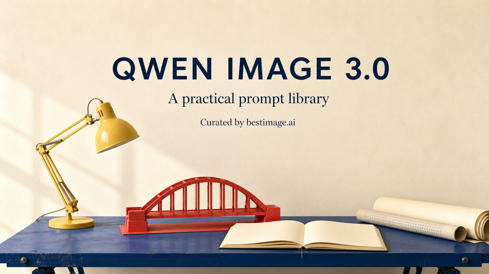
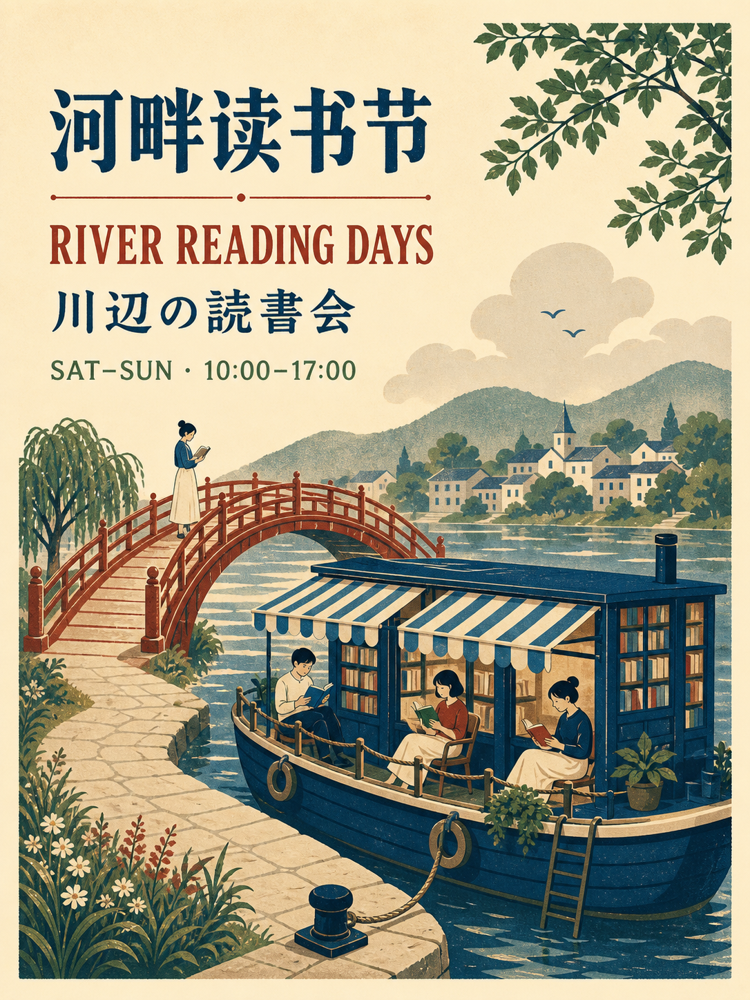
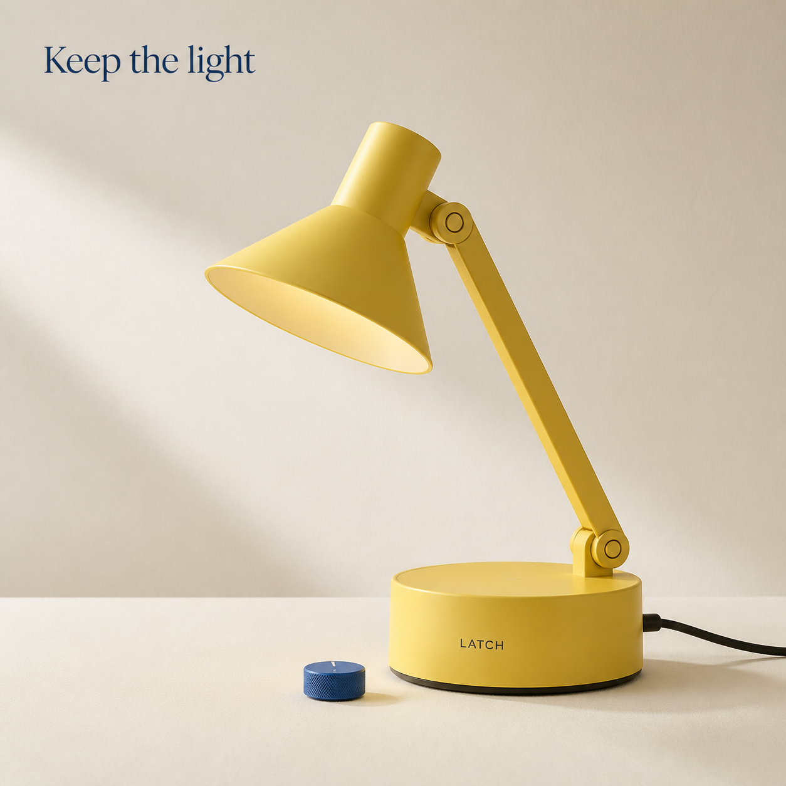
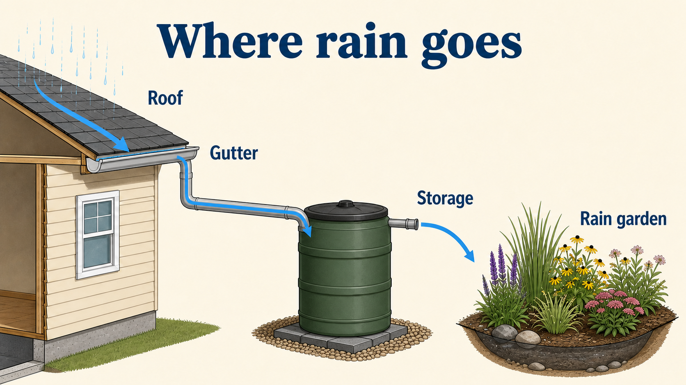
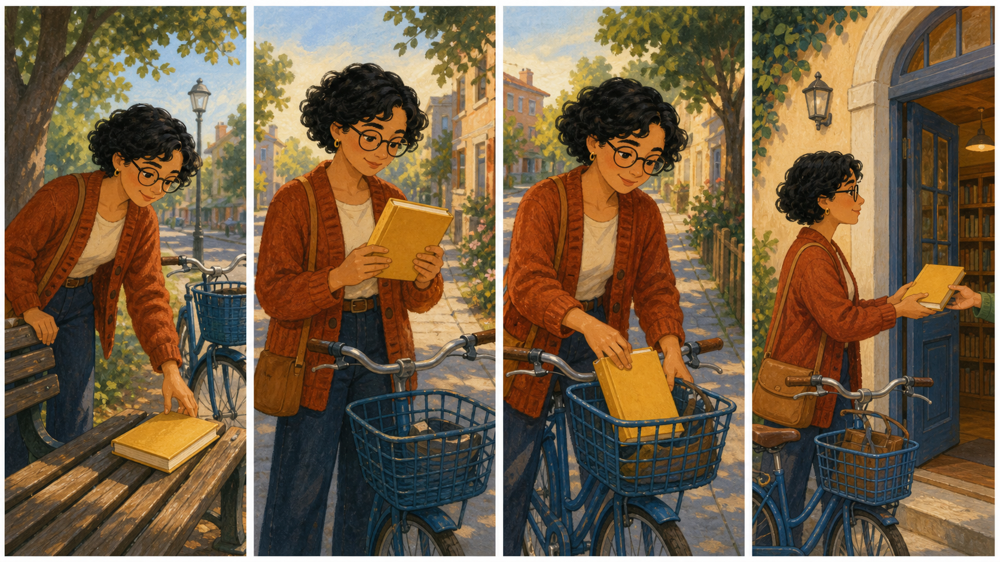
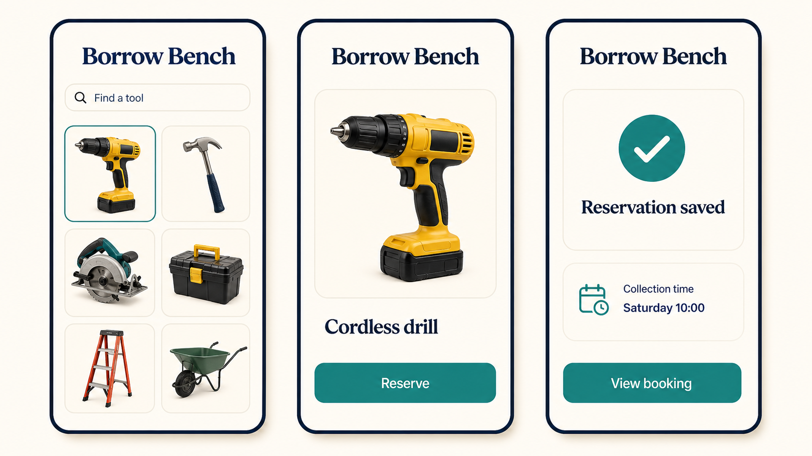
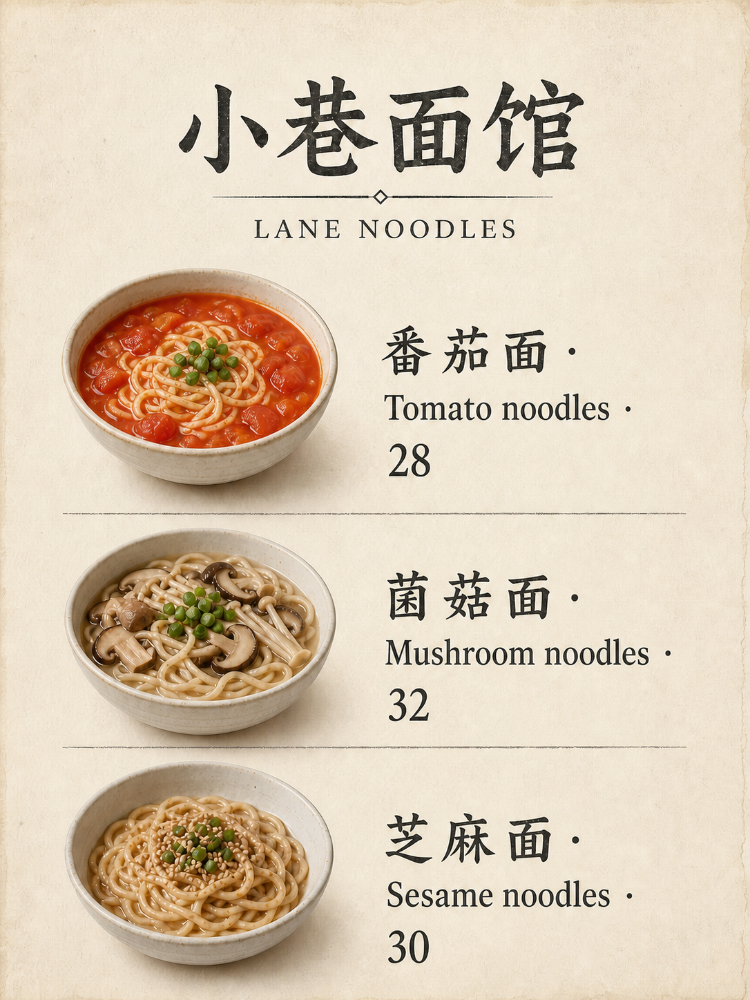

# Awesome Qwen Image 3.0 — библиотека промптов

Практическая библиотека промптов для изображений, которую отбирает и поддерживает команда [bestimage.ai](https://bestimage.ai/). Начните с конкретного результата: фотографии товара, многоязычного плаката, учебной схемы, листа персонажа или контролируемого редактирования изображения.

[English](./README.md) · [简体中文](./README_zh.md) · [繁體中文](./README_tw.md) · [日本語](./README_ja.md) · [한국어](./README_ko.md) · [Español](./README_es.md) · [Français](./README_fr.md) · [Deutsch](./README_de.md) · [Português](./README_pt.md) · [Italiano](./README_it.md) · [Русский](./README_ru.md) · [العربية](./README_ar.md) · [ไทย](./README_th.md) · [Bahasa Indonesia](./README_id.md) · [Tiếng Việt](./README_vi.md)

Обложка и примеры — новые иллюстрации, созданные встроенным инструментом ImageGen, **не тестовые результаты Qwen**. См. [точные промпты и примечания к созданию](./assets/README.md).

## Что внутри

- 180 различных промптов в 18 категориях, по десять в каждой.
- 15 языковых версий README, указателя и полного текста промптов: 270 файлов категорий и 2700 языковых экземпляров, а не 2700 независимых идей.
- 19 новых демонстрационных изображений: одна обложка, шесть основных примеров и двенадцать локализованных версий промпта о ремонтной мастерской.
- 16 многоразовых [производственных шаблонов](./templates/README.md), [матрица сценариев](./docs/use-case-matrix.md) и подробные руководства по [структуре промптов](./docs/qwen-image-3-prompt-guide.md) и [многоязычной типографике](./docs/multilingual-prompting.md). Эти общие руководства поддерживаются на китайском.

По необходимости промпты задают субъекты, композицию, точный текст, роли исходных изображений и важные ограничения. Данные в квадратных скобках должен предоставить пользователь: это не разрешение модели выдумывать факты.

## Начните с промпта

1. [Выберите категорию](./prompts/README_ru.md) и замените все данные в квадратных скобках утверждёнными материалами.
2. Для редактирования загрузите разрешённые образцы в указанном порядке и обозначьте, что должно остаться неизменным.
3. Скопируйте полный промпт. Явно многоязычные строки сохраняйте; обычные локализованные версии уже содержат перевод текста.
4. Проверьте текст, количество объектов, геометрию и композицию в полном и предполагаемом размере показа. Исправляйте по одной проблеме.

Для работы с данными, наукой, историей, безопасностью и медицинской коммуникацией предоставляйте проверенные свидетельства и получайте квалифицированную проверку. Сгенерированные схемы и документы не являются проверенными инструкциями, официальными записями или редактируемыми производственными файлами.

## Почему Qwen Image 3.0

В [официальном объявлении Qwen](https://qwen.ai/blog?id=qwen-image-3.0) подчёркиваются длинные инструкции, детальная типографика, многоязычный текст и сложная компоновка. Это полезные направления для плакатов, редакционных страниц, раскадровок и интерфейсных концепций, но не гарантия правильности каждого результата. Языковой охват репозитория не означает, что модель поддерживает ровно эти пятнадцать языков.

Промпты описывают визуальное намерение. Фактические режимы ввода, ограничения исходных изображений, размеры и доступность зависят от выбранного сервиса и варианта модели. Запрошенное соотношение сторон или выглядящий прозрачным фон не доказывают поддержку в API.

## Используйте bestimage.ai

Команда bestimage.ai поддерживает эту подборку наряду со своей платформой создания изображений и видео.

- [Qwen Image 3.0 Pro API и страница модели](https://bestimage.ai/ru/models/alibaba/qwen-image-3-0-pro/): изучите соответствующий библиотеке процесс Qwen и проверьте доступный вариант перед использованием промпта.
- [GPT Image 2 API и страница модели](https://bestimage.ai/ru/models/openai/gpt-image-2/): отдельный процесс создания и редактирования изображений OpenAI для связанных визуальных задач. Это не Qwen и не тот же конечный адрес модели.

Сведения об учётных данных, запросах и ценах смотрите в актуальной документации выбранного сервиса.

## Примеры для проверки

| Многоязычный плакат | Фотография товара | Учебная схема |
| --- | --- | --- |
|  |  |  |
| [MKT-02](./prompts/01-brand-social-marketing.md#mkt-02) | [COM-01](./prompts/02-ecommerce-product-food.md#com-01) | [EDU-01](./prompts/03-infographic-education-business.md#edu-01) |

| История в четырёх панелях | Концепция интерфейса | Двуязычное меню |
| --- | --- | --- |
|  |  |  |
| [ART-01](./prompts/04-portrait-character-storytelling.md#art-01) | [DIG-01](./prompts/05-ui-game-editing-multilingual.md#dig-01) | [COM-07](./prompts/02-ecommerce-product-food.md#com-07) |

Эти общие примеры используют канонические промпты по ссылкам; при смене языка README изображения автоматически не переводятся. Локализованные примеры ремонтной мастерской связаны с точными местными промптами в [языковых указателях](./prompts/README_ru.md).

## Все категории

| Категория | Промптов |
| --- | ---: |
| [Бренды, плакаты и кампании](./prompts/ru/01-brand-social-marketing.md) | 10 |
| [Электронная торговля, товары и еда](./prompts/ru/02-ecommerce-product-food.md) | 10 |
| [Инфографика, образование и бизнес](./prompts/ru/03-infographic-education-business.md) | 10 |
| [Персонажи, портреты и раскадровки](./prompts/ru/04-portrait-character-storytelling.md) | 10 |
| [Интерфейсы, точечное редактирование и локализация](./prompts/ru/05-ui-game-editing-multilingual.md) | 10 |
| [Аватары, команды и повседневные портреты](./prompts/ru/06-profile-avatar-people.md) | 10 |
| [Социальные публикации, обложки и авторский контент](./prompts/ru/07-social-media-content.md) | 10 |
| [Архитектура, интерьеры и концепции недвижимости](./prompts/ru/08-architecture-interior-realestate.md) | 10 |
| [Мода, красота и текстильные концепции](./prompts/ru/09-fashion-beauty-lookbook.md) | 10 |
| [Путешествия, пейзажи, города и транспорт](./prompts/ru/10-travel-landscape-city-vehicle.md) | 10 |
| [Животные, существа и ботанические этюды](./prompts/ru/11-animal-creature-botanical.md) | 10 |
| [Типографика, редакционный дизайн и узоры](./prompts/ru/12-typography-logo-editorial-background.md) | 10 |
| [Игровые ассеты, оборудование и промышленные концепции](./prompts/ru/13-game-assets-industrial-concepts.md) | 10 |
| [Фотография и кинематографический реализм](./prompts/ru/14-photography-cinematic-realism.md) | 10 |
| [Иллюстрация и эксперименты с материалами](./prompts/ru/15-illustration-material-experiments.md) | 10 |
| [Документы, издательское дело и информационный дизайн](./prompts/ru/16-documents-publishing-information.md) | 10 |
| [История, культура и интерпретация по свидетельствам](./prompts/ru/17-history-culture-heritage.md) | 10 |
| [Наука, технические схемы и объяснения](./prompts/ru/18-science-technical-knowledge.md) | 10 |

## Участие в проекте

Делитесь полезными промптами, примерами и переводами согласно [руководству для участников](CONTRIBUTING.md).

## О bestimage.ai

Команда [bestimage.ai](https://bestimage.ai/) составляет и поддерживает эту библиотеку промптов, связывая творческие рабочие процессы с API моделей изображений и видео.

## Зарабатывайте с партнёрской программой bestimage.ai

Публикуете уроки, промпты или примеры интеграции API? Присоединяйтесь к [партнёрской программе bestimage.ai](https://bestimage.ai/affiliate-program/) и получайте комиссию, рекомендуя bestimage.ai своей аудитории.

- **20%** за первый подходящий оплаченный заказ привлечённого пользователя.
- **10%** за его последующие подходящие оплаченные заказы в течение **60 дней после регистрации**.

Критерии заказов и выплаты регулируются [действующим партнёрским соглашением](https://bestimage.ai/affiliate-agreement/).

## Лицензия

[MIT](LICENSE).
