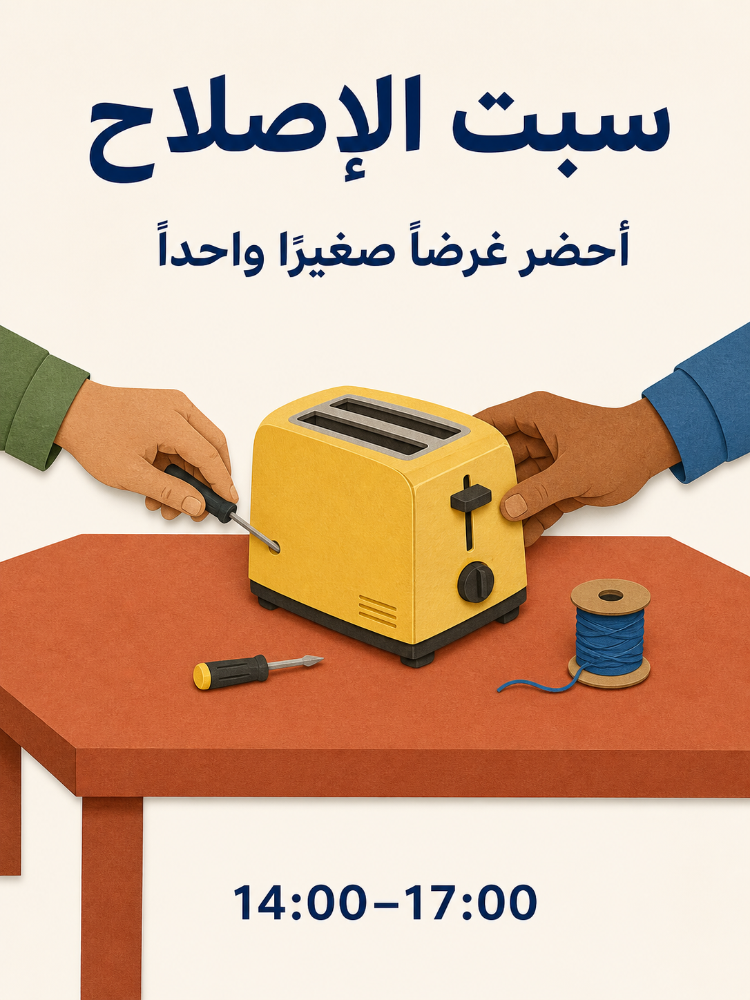

# مكتبة أوامر Qwen Image 3.0

180 قالبًا، وثماني عشرة فئة، وعشرة قوالب في كل فئة. تترجم الإصدارات اللغوية الخمسة عشر المفاهيم الـ180 نفسها؛ لا تُحسب النسخ اللغوية أفكارًا جديدة.

[English](./README.md) · [简体中文](./README_zh.md) · [繁體中文](./README_tw.md) · [日本語](./README_ja.md) · [한국어](./README_ko.md) · [Español](./README_es.md) · [Français](./README_fr.md) · [Deutsch](./README_de.md) · [Português](./README_pt.md) · [Italiano](./README_it.md) · [Русский](./README_ru.md) · [العربية](./README_ar.md) · [ไทย](./README_th.md) · [Bahasa Indonesia](./README_id.md) · [Tiếng Việt](./README_vi.md)

## اختر الناتج

| المعرّفات | الفئة |
| --- | --- |
| MKT-01–10 | [العلامات التجارية والملصقات والحملات](./ar/01-brand-social-marketing.md) |
| COM-01–10 | [التجارة الإلكترونية والمنتجات والطعام](./ar/02-ecommerce-product-food.md) |
| EDU-01–10 | [الرسوم المعلوماتية والتعليم والأعمال](./ar/03-infographic-education-business.md) |
| ART-01–10 | [الشخصيات والصور الشخصية ولوحات القصة](./ar/04-portrait-character-storytelling.md) |
| DIG-01–10 | [الواجهات والتعديلات المنضبطة والتوطين](./ar/05-ui-game-editing-multilingual.md) |
| AVA-01–10 | [الصور الرمزية والفرق والصور اليومية](./ar/06-profile-avatar-people.md) |
| SOC-01–10 | [منشورات التواصل والأغلفة ومحتوى المبدعين](./ar/07-social-media-content.md) |
| ARC-01–10 | [العمارة والتصميم الداخلي وتصورات العقارات](./ar/08-architecture-interior-realestate.md) |
| FAS-01–10 | [الأزياء والجمال وتصورات المنسوجات](./ar/09-fashion-beauty-lookbook.md) |
| TRV-01–10 | [السفر والمناظر والمدن والمركبات](./ar/10-travel-landscape-city-vehicle.md) |
| NAT-01–10 | [الحيوانات والكائنات والدراسات النباتية](./ar/11-animal-creature-botanical.md) |
| TYP-01–10 | [الطباعة والتصميم التحريري والأنماط](./ar/12-typography-logo-editorial-background.md) |
| PRO-01–10 | [أصول الألعاب والمعدات والتصورات الصناعية](./ar/13-game-assets-industrial-concepts.md) |
| PHO-01–10 | [التصوير والواقعية السينمائية](./ar/14-photography-cinematic-realism.md) |
| ILL-01–10 | [الرسم وتجارب المواد](./ar/15-illustration-material-experiments.md) |
| DOC-01–10 | [المستندات والنشر وتصميم المعلومات](./ar/16-documents-publishing-information.md) |
| CUL-01–10 | [التاريخ والثقافة والتفسير القائم على الأدلة](./ar/17-history-culture-heritage.md) |
| SCI-01–10 | [العلوم والمخططات التقنية والشروح](./ar/18-science-technical-knowledge.md) |

## الأمر المختار: ورشة إصلاح

[افتح MKT-09](./ar/01-brand-social-marketing.md#mkt-09). تتضمن اثنا عشر فهرسًا لغويًا رسومًا محلية جديدة للقالب نفسه. تستخدم الرسوم أداة ImageGen المدمجة لا Qwen، وليست اختبارات أداء للنموذج.



```text
أنشئ ملصقًا بنسبة 3:4 لورشة إصلاح مجتمعية خيالية. ارسم طاولة واحدة بلون الطين المحروق تحمل محمصة صفراء ومفكًا صغيرًا وبكرة خيط أزرق؛ تعمل يدان لشخصين بالغين على المحمصة من جهتين متقابلتين. استخدم أشكال قصاصات ورق نظيفة وخلفية كريمية وحروفًا كحلية وتباعدًا واسعًا. في الأعلى اكتب "سبت الإصلاح"؛ وتحته "أحضر غرضًا صغيرًا واحدًا"؛ وفي الأسفل "14:00–17:00". اعرض كل سطر مرة واحدة ولا شيء سواه. اجعل اليدين معقولتين تشريحيًا والمحمصة مفصولة عن الكهرباء. المتغيرات: النص المحلي المعتمد ولوحة الألوان.
```

## التعامل مع النص الدقيق

استبدل المدخلات بين الأقواس المربعة قبل التوليد. اقتبس النصوص النهائية على الصورة بدقة ولا تطلب من النموذج اختلاق حقائق مفقودة. للقوالب المقصودة بلغتين أو ثلاث، احفظ اللغات المحددة. وفي التعديل المرجعي قدّم صورًا مأذونة بالترتيب المذكور.

استخدم القالب كاملًا وافحص النتيجة وعدّل خطأ واحدًا كل مرة. لوحة القصة الثابتة ليست فيديو؛ صورة الواجهة ليست تطبيقًا عاملًا؛ والمخطط المولد ليس مستندًا تقنيًا متحققًا منه.

[قوالب الإنتاج](../templates/README.md) · [أوامر الصور ومصدرها](../assets/README.md) · [README الرئيسي](../README_ar.md)
