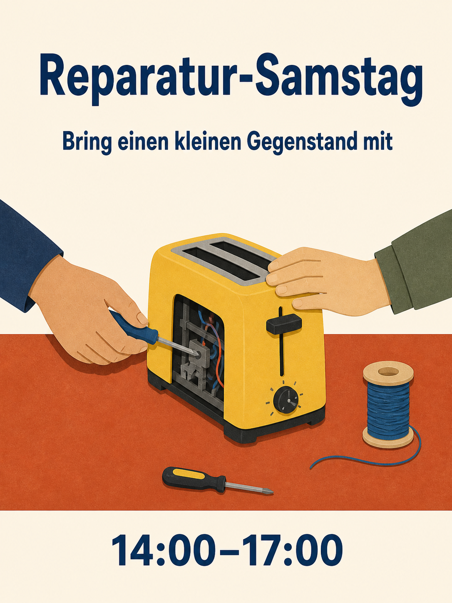

# Qwen Image 3.0 Prompt-Bibliothek

180 Rezepte, achtzehn Kategorien, zehn Rezepte pro Kategorie. Die 15 Sprachausgaben übersetzen dieselben 180 Konzepte; Sprachkopien zählen nicht als neue Ideen.

[English](./README.md) · [简体中文](./README_zh.md) · [繁體中文](./README_tw.md) · [日本語](./README_ja.md) · [한국어](./README_ko.md) · [Español](./README_es.md) · [Français](./README_fr.md) · [Deutsch](./README_de.md) · [Português](./README_pt.md) · [Italiano](./README_it.md) · [Русский](./README_ru.md) · [العربية](./README_ar.md) · [ไทย](./README_th.md) · [Bahasa Indonesia](./README_id.md) · [Tiếng Việt](./README_vi.md)

## Ergebnis wählen

| Kennungen | Kategorie |
| --- | --- |
| MKT-01–10 | [Marken, Plakate und Kampagnen](./de/01-brand-social-marketing.md) |
| COM-01–10 | [E-Commerce, Produkte und Lebensmittel](./de/02-ecommerce-product-food.md) |
| EDU-01–10 | [Infografiken, Bildung und Unternehmen](./de/03-infographic-education-business.md) |
| ART-01–10 | [Figuren, Porträts und Storyboards](./de/04-portrait-character-storytelling.md) |
| DIG-01–10 | [Oberflächen, kontrollierte Bearbeitungen und Lokalisierung](./de/05-ui-game-editing-multilingual.md) |
| AVA-01–10 | [Avatare, Teams und Alltagsporträts](./de/06-profile-avatar-people.md) |
| SOC-01–10 | [Social-Media-Beiträge, Titelbilder und Creator-Inhalte](./de/07-social-media-content.md) |
| ARC-01–10 | [Architektur, Innenräume und Immobilienkonzepte](./de/08-architecture-interior-realestate.md) |
| FAS-01–10 | [Mode, Beauty und Textilkonzepte](./de/09-fashion-beauty-lookbook.md) |
| TRV-01–10 | [Reisen, Landschaften, Städte und Fahrzeuge](./de/10-travel-landscape-city-vehicle.md) |
| NAT-01–10 | [Tiere, Kreaturen und botanische Studien](./de/11-animal-creature-botanical.md) |
| TYP-01–10 | [Typografie, Editorial Design und Muster](./de/12-typography-logo-editorial-background.md) |
| PRO-01–10 | [Spielressourcen, Ausrüstung und Industriekonzepte](./de/13-game-assets-industrial-concepts.md) |
| PHO-01–10 | [Fotografie und filmischer Realismus](./de/14-photography-cinematic-realism.md) |
| ILL-01–10 | [Illustration und Materialexperimente](./de/15-illustration-material-experiments.md) |
| DOC-01–10 | [Dokumente, Veröffentlichung und Informationsdesign](./de/16-documents-publishing-information.md) |
| CUL-01–10 | [Geschichte, Kultur und beleggestützte Interpretation](./de/17-history-culture-heritage.md) |
| SCI-01–10 | [Wissenschaft, technische Diagramme und Erklärbilder](./de/18-science-technical-knowledge.md) |

## Ausgewählter Prompt: Reparaturwerkstatt

[MKT-09 öffnen](./de/01-brand-social-marketing.md#mkt-09). Zwölf Sprachverzeichnisse enthalten neu generierte lokalisierte Illustrationen dieses Rezepts. Diese nutzen das integrierte ImageGen-Werkzeug, nicht Qwen, und sind keine Modellbenchmarks.



```text
Erstelle ein Plakat im Format 3:4 für eine fiktive gemeinschaftliche Reparaturwerkstatt. Illustriere einen terrakottafarbenen Tisch mit einem gelben Toaster, einem kleinen Schraubendreher und einer Spule blauen Garns; zwei erwachsene Hände arbeiten von gegenüberliegenden Seiten am Toaster. Verwende klare Scherenschnittformen, cremefarbenen Hintergrund, marineblaue Typografie und großzügige Abstände. Zeige oben "Reparatur-Samstag", darunter "Bring einen kleinen Gegenstand mit" und unten "14:00–17:00". Jede Zeile genau einmal, sonst nichts. Halte die Hände anatomisch plausibel und den Toaster vom Strom getrennt. Variablen: freigegebener lokalisierter Text und Farbpalette.
```

## Mit exaktem Text arbeiten

Ersetze Angaben in eckigen Klammern vor der Generierung. Zitiere endgültige Bildtexte exakt und fordere das Modell nicht zum Erfinden fehlender Fakten auf. Bewahre bei bewusst zwei- oder dreisprachigen Rezepten die angegebenen Sprachen. Liefere bei Referenzbearbeitungen autorisierte Bilder in der angegebenen Reihenfolge.

Nutze das vollständige Rezept, prüfe das Ergebnis und korrigiere jeweils einen Fehler. Ein statisches Storyboard ist kein Video; ein Oberflächenbild ist keine funktionierende App; ein generiertes Diagramm ist kein validiertes technisches Dokument.

[Produktionsvorlagen](../templates/README.md) · [Bild-Prompts und Herkunft](../assets/README.md) · [Haupt-README](../README_de.md)
