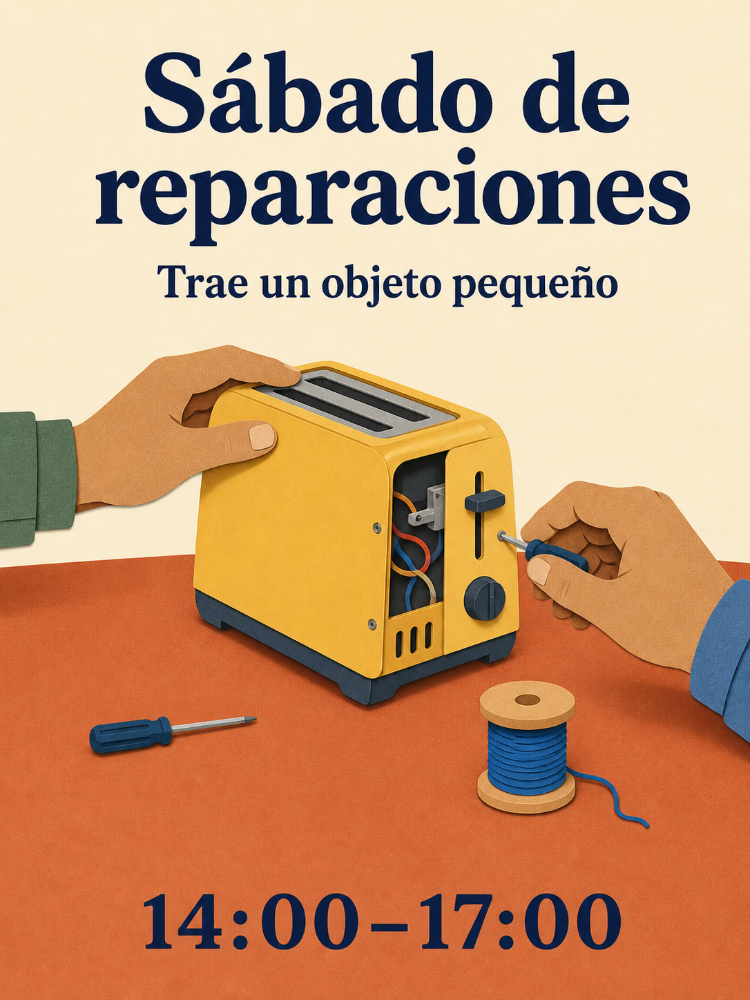

# Biblioteca de prompts de Qwen Image 3.0

180 recetas, dieciocho categorías, diez recetas por categoría. Las 15 ediciones lingüísticas traducen los mismos 180 conceptos; las versiones por idioma no se cuentan como ideas nuevas.

[English](./README.md) · [简体中文](./README_zh.md) · [繁體中文](./README_tw.md) · [日本語](./README_ja.md) · [한국어](./README_ko.md) · [Español](./README_es.md) · [Français](./README_fr.md) · [Deutsch](./README_de.md) · [Português](./README_pt.md) · [Italiano](./README_it.md) · [Русский](./README_ru.md) · [العربية](./README_ar.md) · [ไทย](./README_th.md) · [Bahasa Indonesia](./README_id.md) · [Tiếng Việt](./README_vi.md)

## Elige un resultado

| Identificadores | Categoría |
| --- | --- |
| MKT-01–10 | [Marca, carteles y campañas](./es/01-brand-social-marketing.md) |
| COM-01–10 | [Comercio electrónico, productos y alimentos](./es/02-ecommerce-product-food.md) |
| EDU-01–10 | [Infografías, educación y negocios](./es/03-infographic-education-business.md) |
| ART-01–10 | [Personajes, retratos y guiones gráficos](./es/04-portrait-character-storytelling.md) |
| DIG-01–10 | [Interfaces, ediciones controladas y localización](./es/05-ui-game-editing-multilingual.md) |
| AVA-01–10 | [Avatares, equipos y retratos cotidianos](./es/06-profile-avatar-people.md) |
| SOC-01–10 | [Publicaciones sociales, portadas y contenido de creadores](./es/07-social-media-content.md) |
| ARC-01–10 | [Arquitectura, interiores y conceptos inmobiliarios](./es/08-architecture-interior-realestate.md) |
| FAS-01–10 | [Moda, belleza y conceptos textiles](./es/09-fashion-beauty-lookbook.md) |
| TRV-01–10 | [Viajes, paisajes, ciudades y vehículos](./es/10-travel-landscape-city-vehicle.md) |
| NAT-01–10 | [Animales, criaturas y estudios botánicos](./es/11-animal-creature-botanical.md) |
| TYP-01–10 | [Tipografía, diseño editorial y patrones](./es/12-typography-logo-editorial-background.md) |
| PRO-01–10 | [Recursos de juego, equipamiento y conceptos industriales](./es/13-game-assets-industrial-concepts.md) |
| PHO-01–10 | [Fotografía y realismo cinematográfico](./es/14-photography-cinematic-realism.md) |
| ILL-01–10 | [Ilustración y experimentos con materiales](./es/15-illustration-material-experiments.md) |
| DOC-01–10 | [Documentos, edición y diseño de información](./es/16-documents-publishing-information.md) |
| CUL-01–10 | [Historia, cultura e interpretación basada en pruebas](./es/17-history-culture-heritage.md) |
| SCI-01–10 | [Ciencia, diagramas técnicos y explicaciones](./es/18-science-technical-knowledge.md) |

## Prompt destacado: taller de reparación

[Abrir MKT-09](./es/01-brand-social-marketing.md#mkt-09). Doce índices lingüísticos incluyen ilustraciones localizadas nuevas de esta misma receta. Se generaron con la herramienta integrada ImageGen, no con Qwen, y no son pruebas comparativas de modelos.



```text
Crea un cartel de 3:4 para un taller comunitario ficticio de reparación. Ilustra una mesa color terracota con una tostadora amarilla, un destornillador pequeño y un carrete de hilo azul; dos manos adultas trabajan en la tostadora desde lados opuestos. Usa formas limpias de papel recortado, fondo crema, tipografía azul marino y espacio amplio. Arriba escribe "Sábado de reparaciones"; debajo, "Trae un objeto pequeño"; abajo, "14:00–17:00". Reproduce cada línea una vez y nada más. Mantén las manos anatómicamente plausibles y la tostadora desenchufada. Variables: texto localizado aprobado y paleta.
```

## Trabajar con texto exacto

Sustituye los datos entre corchetes antes de generar. Especifica exactamente entre comillas el texto final de la imagen y no pidas al modelo que invente hechos faltantes. Para recetas deliberadamente bilingües o trilingües, conserva los idiomas indicados. Para editar referencias, proporciona imágenes autorizadas en el orden establecido.

Usa la receta completa, revisa el resultado y corrige un fallo cada vez. Un guion gráfico estático no es un vídeo; una imagen de interfaz no es una aplicación funcional; un diagrama generado no es un documento técnico validado.

[Plantillas de producción](../templates/README.md) · [Prompts y procedencia de las imágenes](../assets/README.md) · [README principal](../README_es.md)
