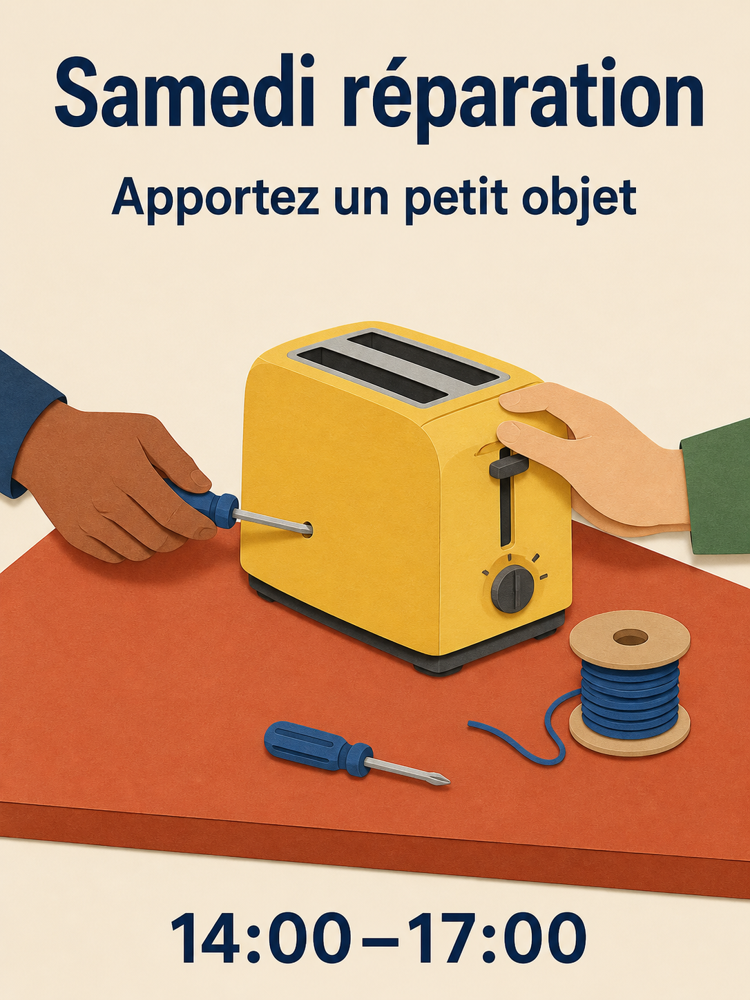

# Bibliothèque de prompts Qwen Image 3.0

180 recettes, dix-huit catégories, dix recettes par catégorie. Les 15 éditions linguistiques traduisent les mêmes 180 concepts ; les versions linguistiques ne sont pas comptées comme de nouvelles idées.

[English](./README.md) · [简体中文](./README_zh.md) · [繁體中文](./README_tw.md) · [日本語](./README_ja.md) · [한국어](./README_ko.md) · [Español](./README_es.md) · [Français](./README_fr.md) · [Deutsch](./README_de.md) · [Português](./README_pt.md) · [Italiano](./README_it.md) · [Русский](./README_ru.md) · [العربية](./README_ar.md) · [ไทย](./README_th.md) · [Bahasa Indonesia](./README_id.md) · [Tiếng Việt](./README_vi.md)

## Choisir un résultat

| Identifiants | Catégorie |
| --- | --- |
| MKT-01–10 | [Marque, affiches et campagnes](./fr/01-brand-social-marketing.md) |
| COM-01–10 | [Commerce en ligne, produits et alimentation](./fr/02-ecommerce-product-food.md) |
| EDU-01–10 | [Infographies, éducation et entreprise](./fr/03-infographic-education-business.md) |
| ART-01–10 | [Personnages, portraits et storyboards](./fr/04-portrait-character-storytelling.md) |
| DIG-01–10 | [Interfaces, retouches contrôlées et localisation](./fr/05-ui-game-editing-multilingual.md) |
| AVA-01–10 | [Avatars, équipes et portraits du quotidien](./fr/06-profile-avatar-people.md) |
| SOC-01–10 | [Publications sociales, couvertures et contenus de créateurs](./fr/07-social-media-content.md) |
| ARC-01–10 | [Architecture, intérieurs et concepts immobiliers](./fr/08-architecture-interior-realestate.md) |
| FAS-01–10 | [Mode, beauté et concepts textiles](./fr/09-fashion-beauty-lookbook.md) |
| TRV-01–10 | [Voyages, paysages, villes et véhicules](./fr/10-travel-landscape-city-vehicle.md) |
| NAT-01–10 | [Animaux, créatures et études botaniques](./fr/11-animal-creature-botanical.md) |
| TYP-01–10 | [Typographie, conception éditoriale et motifs](./fr/12-typography-logo-editorial-background.md) |
| PRO-01–10 | [Ressources de jeu, équipements et concepts industriels](./fr/13-game-assets-industrial-concepts.md) |
| PHO-01–10 | [Photographie et réalisme cinématographique](./fr/14-photography-cinematic-realism.md) |
| ILL-01–10 | [Illustration et expérimentations de matériaux](./fr/15-illustration-material-experiments.md) |
| DOC-01–10 | [Documents, édition et design d’information](./fr/16-documents-publishing-information.md) |
| CUL-01–10 | [Histoire, culture et interprétation fondée sur les preuves](./fr/17-history-culture-heritage.md) |
| SCI-01–10 | [Sciences, schémas techniques et explications](./fr/18-science-technical-knowledge.md) |

## Prompt à la une : atelier de réparation

[Ouvrir MKT-09](./fr/01-brand-social-marketing.md#mkt-09). Douze index linguistiques incluent de nouvelles illustrations localisées de cette recette. Elles utilisent l’outil intégré ImageGen, pas Qwen, et ne constituent pas des tests comparatifs de modèles.



```text
Crée une affiche au format 3:4 pour un atelier communautaire fictif de réparation. Illustre une table terracotta portant un grille-pain jaune, un petit tournevis et une bobine de fil bleu ; deux mains adultes travaillent sur le grille-pain depuis des côtés opposés. Utilise des formes nettes en papier découpé, un fond crème, une typographie bleu marine et un espacement généreux. En haut, affiche "Samedi réparation" ; dessous, "Apportez un petit objet" ; en bas, "14:00–17:00". Affiche chaque ligne une seule fois, sans rien ajouter. Garde les mains anatomiquement plausibles et le grille-pain débranché. Variables : texte localisé approuvé et palette.
```

## Travailler avec un texte exact

Remplacez les données entre crochets avant génération. Citez exactement les textes finaux à afficher dans l’image et ne demandez pas au modèle d’inventer les faits manquants. Préservez les langues indiquées pour les recettes volontairement bilingues ou trilingues. Pour les retouches, fournissez les images autorisées dans l’ordre indiqué.

Utilisez la recette complète, vérifiez le résultat et corrigez un défaut à la fois. Un storyboard fixe n’est pas une vidéo ; une image d’interface n’est pas une application fonctionnelle ; un schéma généré n’est pas un document technique validé.

[Modèles de production](../templates/README.md) · [Prompts et provenance des images](../assets/README.md) · [README principal](../README_fr.md)
