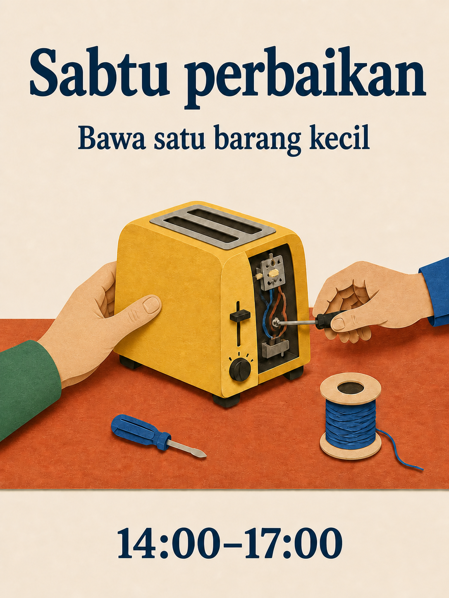

# Pustaka prompt Qwen Image 3.0

180 resep, delapan belas kategori, sepuluh resep per kategori. Kelima belas edisi bahasa menerjemahkan 180 konsep yang sama; salinan bahasa tidak dihitung sebagai ide baru.

[English](./README.md) · [简体中文](./README_zh.md) · [繁體中文](./README_tw.md) · [日本語](./README_ja.md) · [한국어](./README_ko.md) · [Español](./README_es.md) · [Français](./README_fr.md) · [Deutsch](./README_de.md) · [Português](./README_pt.md) · [Italiano](./README_it.md) · [Русский](./README_ru.md) · [العربية](./README_ar.md) · [ไทย](./README_th.md) · [Bahasa Indonesia](./README_id.md) · [Tiếng Việt](./README_vi.md)

## Pilih hasil

| ID | Kategori |
| --- | --- |
| MKT-01–10 | [Merek, poster, dan kampanye](./id/01-brand-social-marketing.md) |
| COM-01–10 | [Perdagangan elektronik, produk, dan makanan](./id/02-ecommerce-product-food.md) |
| EDU-01–10 | [Infografik, pendidikan, dan bisnis](./id/03-infographic-education-business.md) |
| ART-01–10 | [Karakter, potret, dan papan cerita](./id/04-portrait-character-storytelling.md) |
| DIG-01–10 | [Antarmuka, penyuntingan terkontrol, dan pelokalan](./id/05-ui-game-editing-multilingual.md) |
| AVA-01–10 | [Avatar, tim, dan potret keseharian](./id/06-profile-avatar-people.md) |
| SOC-01–10 | [Kiriman sosial, sampul, dan konten kreator](./id/07-social-media-content.md) |
| ARC-01–10 | [Arsitektur, interior, dan konsep properti](./id/08-architecture-interior-realestate.md) |
| FAS-01–10 | [Mode, kecantikan, dan konsep tekstil](./id/09-fashion-beauty-lookbook.md) |
| TRV-01–10 | [Perjalanan, lanskap, kota, dan kendaraan](./id/10-travel-landscape-city-vehicle.md) |
| NAT-01–10 | [Hewan, makhluk, dan studi botani](./id/11-animal-creature-botanical.md) |
| TYP-01–10 | [Tipografi, desain editorial, dan pola](./id/12-typography-logo-editorial-background.md) |
| PRO-01–10 | [Aset gim, perlengkapan, dan konsep industri](./id/13-game-assets-industrial-concepts.md) |
| PHO-01–10 | [Fotografi dan realisme sinematis](./id/14-photography-cinematic-realism.md) |
| ILL-01–10 | [Ilustrasi dan eksperimen bahan](./id/15-illustration-material-experiments.md) |
| DOC-01–10 | [Dokumen, penerbitan, dan desain informasi](./id/16-documents-publishing-information.md) |
| CUL-01–10 | [Sejarah, budaya, dan interpretasi berbasis bukti](./id/17-history-culture-heritage.md) |
| SCI-01–10 | [Sains, diagram teknis, dan penjelasan](./id/18-science-technical-knowledge.md) |

## Prompt pilihan: lokakarya perbaikan

[Buka MKT-09](./id/01-brand-social-marketing.md#mkt-09). Dua belas indeks bahasa menyertakan ilustrasi lokal baru dari resep yang sama. Ilustrasi ini memakai alat ImageGen bawaan, bukan Qwen, dan bukan tolok ukur model.



```text
Buat poster 3:4 untuk lokakarya perbaikan komunitas fiktif. Ilustrasikan satu meja terakota dengan pemanggang roti kuning, obeng kecil, dan gulungan benang biru; dua tangan orang dewasa mengerjakan pemanggang dari sisi berlawanan. Gunakan bentuk potongan kertas bersih, latar krem, tipografi biru tua, dan jarak lapang. Di atas tampilkan "Sabtu perbaikan"; di bawahnya "Bawa satu barang kecil"; di bagian bawah "14:00–17:00". Tampilkan setiap baris sekali saja tanpa tambahan. Pastikan tangan masuk akal secara anatomis dan pemanggang tidak terhubung ke listrik. Variabel: teks lokal yang disetujui dan palet.
```

## Bekerja dengan teks persis

Ganti masukan dalam kurung siku sebelum pembuatan gambar. Kutip teks akhir pada gambar secara persis dan jangan meminta model mengarang fakta yang hilang. Untuk resep yang sengaja memakai dua atau tiga bahasa, pertahankan bahasa tersebut. Untuk penyuntingan acuan, berikan gambar berizin sesuai urutan.

Gunakan resep lengkap, periksa hasil, dan sesuaikan satu kegagalan setiap kali. Papan cerita diam bukan video; gambar antarmuka bukan aplikasi berfungsi; diagram buatan bukan dokumen teknis tervalidasi.

[Templat produksi](../templates/README.md) · [Prompt aset dan asal-usulnya](../assets/README.md) · [README utama](../README_id.md)
