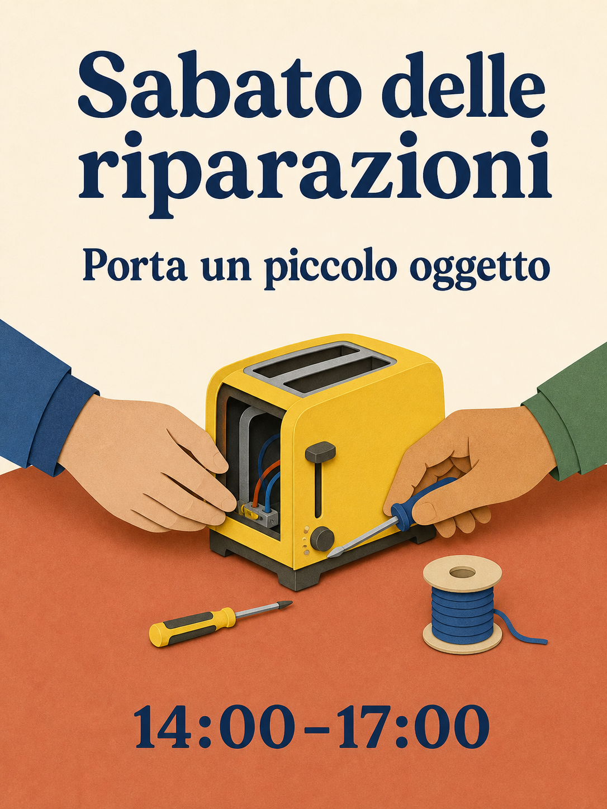

# Biblioteca di prompt Qwen Image 3.0

180 ricette, diciotto categorie, dieci ricette per categoria. Le 15 edizioni linguistiche traducono gli stessi 180 concetti; le copie linguistiche non contano come nuove idee.

[English](./README.md) · [简体中文](./README_zh.md) · [繁體中文](./README_tw.md) · [日本語](./README_ja.md) · [한국어](./README_ko.md) · [Español](./README_es.md) · [Français](./README_fr.md) · [Deutsch](./README_de.md) · [Português](./README_pt.md) · [Italiano](./README_it.md) · [Русский](./README_ru.md) · [العربية](./README_ar.md) · [ไทย](./README_th.md) · [Bahasa Indonesia](./README_id.md) · [Tiếng Việt](./README_vi.md)

## Scegli un risultato

| Identificativi | Categoria |
| --- | --- |
| MKT-01–10 | [Marchi, manifesti e campagne](./it/01-brand-social-marketing.md) |
| COM-01–10 | [E-commerce, prodotti e alimenti](./it/02-ecommerce-product-food.md) |
| EDU-01–10 | [Infografiche, istruzione e attività aziendali](./it/03-infographic-education-business.md) |
| ART-01–10 | [Personaggi, ritratti e storyboard](./it/04-portrait-character-storytelling.md) |
| DIG-01–10 | [Interfacce, modifiche controllate e localizzazione](./it/05-ui-game-editing-multilingual.md) |
| AVA-01–10 | [Avatar, team e ritratti quotidiani](./it/06-profile-avatar-people.md) |
| SOC-01–10 | [Post social, copertine e contenuti per creator](./it/07-social-media-content.md) |
| ARC-01–10 | [Architettura, interni e concetti immobiliari](./it/08-architecture-interior-realestate.md) |
| FAS-01–10 | [Moda, bellezza e concetti tessili](./it/09-fashion-beauty-lookbook.md) |
| TRV-01–10 | [Viaggi, paesaggi, città e veicoli](./it/10-travel-landscape-city-vehicle.md) |
| NAT-01–10 | [Animali, creature e studi botanici](./it/11-animal-creature-botanical.md) |
| TYP-01–10 | [Tipografia, design editoriale e motivi](./it/12-typography-logo-editorial-background.md) |
| PRO-01–10 | [Risorse di gioco, attrezzature e concetti industriali](./it/13-game-assets-industrial-concepts.md) |
| PHO-01–10 | [Fotografia e realismo cinematografico](./it/14-photography-cinematic-realism.md) |
| ILL-01–10 | [Illustrazione ed esperimenti sui materiali](./it/15-illustration-material-experiments.md) |
| DOC-01–10 | [Documenti, editoria e design dell’informazione](./it/16-documents-publishing-information.md) |
| CUL-01–10 | [Storia, cultura e interpretazione basata sulle prove](./it/17-history-culture-heritage.md) |
| SCI-01–10 | [Scienza, diagrammi tecnici e spiegazioni](./it/18-science-technical-knowledge.md) |

## Prompt in evidenza: laboratorio di riparazione

[Apri MKT-09](./it/01-brand-social-marketing.md#mkt-09). Dodici indici linguistici includono nuove illustrazioni localizzate della stessa ricetta. Usano lo strumento integrato ImageGen, non Qwen, e non sono confronti prestazionali tra modelli.



```text
Crea un manifesto in formato 3:4 per un laboratorio comunitario immaginario di riparazione. Illustra un tavolo terracotta con un tostapane giallo, un piccolo cacciavite e un rocchetto di filo blu; due mani adulte lavorano al tostapane da lati opposti. Usa forme pulite di carta ritagliata, fondo crema, tipografia blu navy e spazi generosi. In alto inserisci "Sabato delle riparazioni"; sotto, "Porta un piccolo oggetto"; in basso, "14:00–17:00". Riproduci ogni riga una volta e nient’altro. Mantieni le mani anatomicamente plausibili e il tostapane scollegato. Variabili: testo localizzato approvato e tavolozza.
```

## Lavorare con testo esatto

Sostituisci i dati tra parentesi quadre prima della generazione. Riporta esattamente tra virgolette i testi finali nell’immagine e non chiedere al modello di inventare fatti mancanti. Per ricette volutamente bilingui o trilingui, preserva le lingue indicate. Per modificare riferimenti, fornisci immagini autorizzate nell’ordine specificato.

Usa la ricetta completa, verifica il risultato e correggi un difetto alla volta. Uno storyboard statico non è un video; un’immagine d’interfaccia non è un’app funzionante; un diagramma generato non è un documento tecnico validato.

[Modelli di produzione](../templates/README.md) · [Prompt e provenienza delle immagini](../assets/README.md) · [README principale](../README_it.md)
