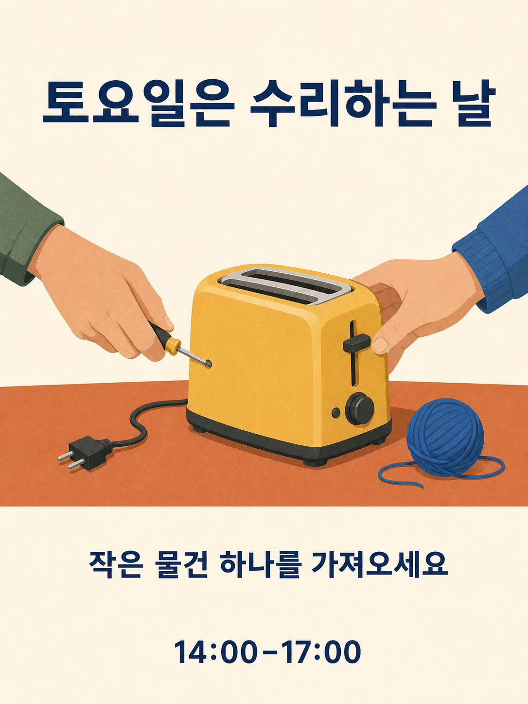

# Qwen Image 3.0 프롬프트 라이브러리

18개 분류에 프롬프트 180개를 수록했으며, 각 분류에는 10개씩 있습니다. 15개 언어 버전은 같은 180개 아이디어를 번역한 것이며, 언어별 사본을 새로운 아이디어로 세지 않습니다.

[English](./README.md) · [简体中文](./README_zh.md) · [繁體中文](./README_tw.md) · [日本語](./README_ja.md) · [한국어](./README_ko.md) · [Español](./README_es.md) · [Français](./README_fr.md) · [Deutsch](./README_de.md) · [Português](./README_pt.md) · [Italiano](./README_it.md) · [Русский](./README_ru.md) · [العربية](./README_ar.md) · [ไทย](./README_th.md) · [Bahasa Indonesia](./README_id.md) · [Tiếng Việt](./README_vi.md)

## 만들 결과물 선택하기

| ID | 분류 |
| --- | --- |
| MKT-01–10 | [브랜드, 포스터, 캠페인](./ko/01-brand-social-marketing.md) |
| COM-01–10 | [전자상거래, 제품, 음식](./ko/02-ecommerce-product-food.md) |
| EDU-01–10 | [인포그래픽, 교육, 비즈니스](./ko/03-infographic-education-business.md) |
| ART-01–10 | [캐릭터, 인물 사진, 스토리보드](./ko/04-portrait-character-storytelling.md) |
| DIG-01–10 | [인터페이스, 범위 제한 편집, 현지화](./ko/05-ui-game-editing-multilingual.md) |
| AVA-01–10 | [아바타, 팀, 일상 인물 사진](./ko/06-profile-avatar-people.md) |
| SOC-01–10 | [소셜 게시물, 표지, 크리에이터 콘텐츠](./ko/07-social-media-content.md) |
| ARC-01–10 | [건축, 실내, 부동산 콘셉트](./ko/08-architecture-interior-realestate.md) |
| FAS-01–10 | [패션, 뷰티, 섬유 콘셉트](./ko/09-fashion-beauty-lookbook.md) |
| TRV-01–10 | [여행, 풍경, 도시, 탈것](./ko/10-travel-landscape-city-vehicle.md) |
| NAT-01–10 | [동물, 상상 속 생물, 식물 연구](./ko/11-animal-creature-botanical.md) |
| TYP-01–10 | [타이포그래피, 편집 디자인, 패턴](./ko/12-typography-logo-editorial-background.md) |
| PRO-01–10 | [게임 소재, 장비, 산업 콘셉트](./ko/13-game-assets-industrial-concepts.md) |
| PHO-01–10 | [사진과 영화적 사실주의](./ko/14-photography-cinematic-realism.md) |
| ILL-01–10 | [일러스트와 재료 실험](./ko/15-illustration-material-experiments.md) |
| DOC-01–10 | [문서, 출판, 정보 디자인](./ko/16-documents-publishing-information.md) |
| CUL-01–10 | [역사, 문화, 근거 중심 해석](./ko/17-history-culture-heritage.md) |
| SCI-01–10 | [과학, 기술 도해, 해설](./ko/18-science-technical-knowledge.md) |

## 추천 프롬프트: 수리 워크숍

[MKT-09 열기](./ko/01-brand-social-marketing.md#mkt-09). 12개 언어별 목록에는 같은 프롬프트로 새로 생성한 현지화 일러스트가 포함되어 있습니다. 이 일러스트는 Qwen이 아닌 내장 ImageGen 도구로 제작했으며, 모델 성능을 평가하는 벤치마크가 아닙니다.



위 이미지는 아래의 한국어 MKT-09 프롬프트로 ImageGen에서 생성한 결과이며, Qwen 출력이 아닙니다.

```text
가상의 지역 수리 워크숍을 위한 3:4 포스터를 만든다. 테라코타색 탁자 위에 노란 토스터, 작은 드라이버, 파란 실타래를 그리고, 서로 반대쪽에서 나온 성인의 손 두 개가 토스터를 수리하게 한다. 깔끔한 종이 오리기 형태, 크림색 배경, 남색 글자, 넉넉한 간격을 사용한다. 위에는 “토요일은 수리하는 날”, 아래에는 “작은 물건 하나를 가져오세요”, 맨 아래에는 “14:00–17:00”를 표시한다. 각 줄은 한 번씩만 쓰고 다른 문구는 넣지 않는다. 손은 해부학적으로 자연스럽고 토스터는 전원이 뽑혀 있어야 한다. 변수: 승인된 현지화 문구와 색상 구성.
```

## 정확한 문구 다루기

생성하기 전에 대괄호 입력값을 바꾸세요. 이미지에 표시할 최종 문자열을 정확하게 인용하고, 빠진 사실을 모델이 만들어 내도록 요청하지 마세요. 의도적으로 이중 언어나 삼중 언어를 사용하는 프롬프트는 지정된 언어를 유지하세요. 참조 이미지를 이용한 편집에서는 사용 권한이 있는 이미지를 지정된 순서대로 제공하세요.

프롬프트 전체를 사용하고 결과를 확인한 뒤 한 번에 문제 하나씩 조정하세요. 정적인 스토리보드는 동영상이 아니며, 인터페이스 이미지는 작동하는 앱이 아니고, 생성된 도해는 검증된 기술 문서가 아닙니다.

[제작 템플릿](../templates/README.md) · [이미지 프롬프트와 출처](../assets/README.md) · [메인 README](../README_ko.md)
