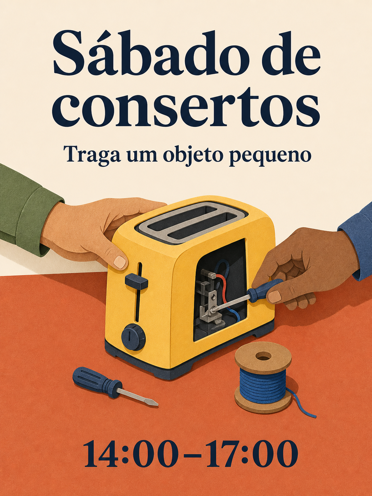

# Biblioteca de prompts Qwen Image 3.0

180 receitas, dezoito categorias, dez receitas por categoria. As 15 edições linguísticas traduzem os mesmos 180 conceitos; cópias por idioma não contam como novas ideias.

[English](./README.md) · [简体中文](./README_zh.md) · [繁體中文](./README_tw.md) · [日本語](./README_ja.md) · [한국어](./README_ko.md) · [Español](./README_es.md) · [Français](./README_fr.md) · [Deutsch](./README_de.md) · [Português](./README_pt.md) · [Italiano](./README_it.md) · [Русский](./README_ru.md) · [العربية](./README_ar.md) · [ไทย](./README_th.md) · [Bahasa Indonesia](./README_id.md) · [Tiếng Việt](./README_vi.md)

## Escolha um resultado

| Identificadores | Categoria |
| --- | --- |
| MKT-01–10 | [Marca, cartazes e campanhas](./pt/01-brand-social-marketing.md) |
| COM-01–10 | [Comércio eletrônico, produtos e alimentos](./pt/02-ecommerce-product-food.md) |
| EDU-01–10 | [Infográficos, educação e negócios](./pt/03-infographic-education-business.md) |
| ART-01–10 | [Personagens, retratos e storyboards](./pt/04-portrait-character-storytelling.md) |
| DIG-01–10 | [Interfaces, edições controladas e localização](./pt/05-ui-game-editing-multilingual.md) |
| AVA-01–10 | [Avatares, equipes e retratos cotidianos](./pt/06-profile-avatar-people.md) |
| SOC-01–10 | [Publicações sociais, capas e conteúdo de criadores](./pt/07-social-media-content.md) |
| ARC-01–10 | [Arquitetura, interiores e conceitos imobiliários](./pt/08-architecture-interior-realestate.md) |
| FAS-01–10 | [Moda, beleza e conceitos têxteis](./pt/09-fashion-beauty-lookbook.md) |
| TRV-01–10 | [Viagens, paisagens, cidades e veículos](./pt/10-travel-landscape-city-vehicle.md) |
| NAT-01–10 | [Animais, criaturas e estudos botânicos](./pt/11-animal-creature-botanical.md) |
| TYP-01–10 | [Tipografia, design editorial e padrões](./pt/12-typography-logo-editorial-background.md) |
| PRO-01–10 | [Recursos de jogos, equipamentos e conceitos industriais](./pt/13-game-assets-industrial-concepts.md) |
| PHO-01–10 | [Fotografia e realismo cinematográfico](./pt/14-photography-cinematic-realism.md) |
| ILL-01–10 | [Ilustração e experimentos com materiais](./pt/15-illustration-material-experiments.md) |
| DOC-01–10 | [Documentos, publicação e design de informação](./pt/16-documents-publishing-information.md) |
| CUL-01–10 | [História, cultura e interpretação baseada em evidências](./pt/17-history-culture-heritage.md) |
| SCI-01–10 | [Ciência, diagramas técnicos e explicações](./pt/18-science-technical-knowledge.md) |

## Prompt em destaque: oficina de consertos

[Abrir MKT-09](./pt/01-brand-social-marketing.md#mkt-09). Doze índices linguísticos incluem novas ilustrações localizadas desta mesma receita. Elas usam a ferramenta integrada ImageGen, não Qwen, e não são testes comparativos de modelos.



```text
Crie um cartaz em 3:4 para uma oficina comunitária fictícia de consertos. Ilustre uma mesa terracota com uma torradeira amarela, uma pequena chave de fenda e um carretel de linha azul; duas mãos adultas trabalham na torradeira de lados opostos. Use formas limpas de papel recortado, fundo creme, tipografia azul-marinho e espaçamento generoso. No alto, exiba "Sábado de consertos"; abaixo, "Traga um objeto pequeno"; na parte inferior, "14:00–17:00". Exiba cada linha uma vez e nada mais. Mantenha mãos anatomicamente plausíveis e a torradeira fora da tomada. Variáveis: texto localizado aprovado e paleta.
```

## Trabalhar com texto exato

Substitua entradas entre colchetes antes de gerar. Cite exatamente os textos finais que devem aparecer na imagem e não peça ao modelo para inventar fatos ausentes. Em receitas deliberadamente bilíngues ou trilíngues, preserve os idiomas especificados. Para editar referências, forneça imagens autorizadas na ordem indicada.

Use a receita completa, confira o resultado e ajuste uma falha por vez. Um storyboard estático não é um vídeo; uma imagem de interface não é um aplicativo funcional; um diagrama gerado não é um documento técnico validado.

[Modelos de produção](../templates/README.md) · [Prompts e procedência das imagens](../assets/README.md) · [README principal](../README_pt.md)
