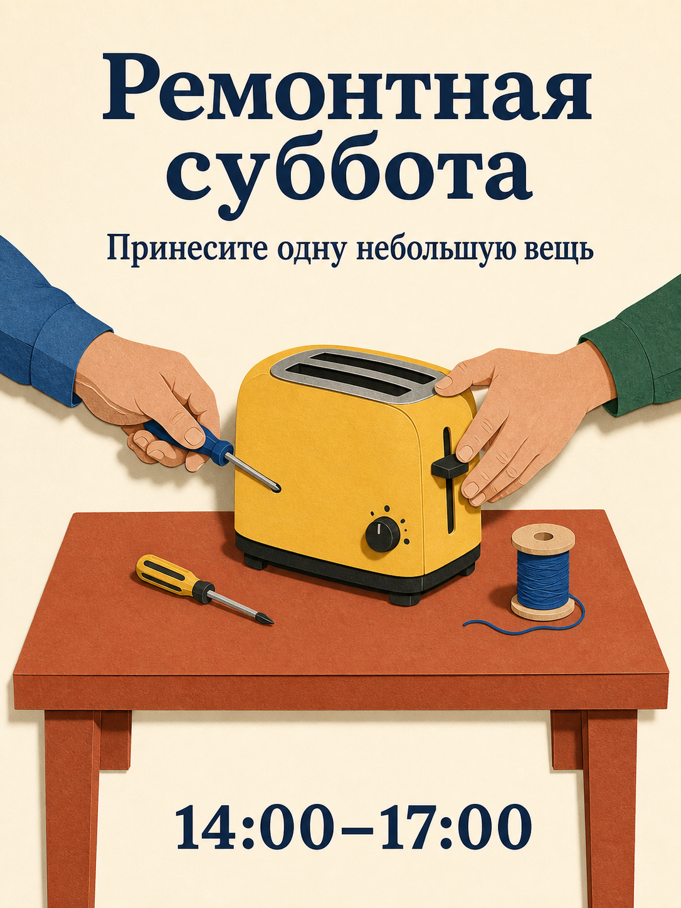

# Библиотека промптов Qwen Image 3.0

180 промптов, восемнадцать категорий, по десять в каждой. Все 15 языковых версий переводят те же 180 концепций; языковые копии не считаются новыми идеями.

[English](./README.md) · [简体中文](./README_zh.md) · [繁體中文](./README_tw.md) · [日本語](./README_ja.md) · [한국어](./README_ko.md) · [Español](./README_es.md) · [Français](./README_fr.md) · [Deutsch](./README_de.md) · [Português](./README_pt.md) · [Italiano](./README_it.md) · [Русский](./README_ru.md) · [العربية](./README_ar.md) · [ไทย](./README_th.md) · [Bahasa Indonesia](./README_id.md) · [Tiếng Việt](./README_vi.md)

## Выберите результат

| Идентификаторы | Категория |
| --- | --- |
| MKT-01–10 | [Бренды, плакаты и кампании](./ru/01-brand-social-marketing.md) |
| COM-01–10 | [Электронная торговля, товары и еда](./ru/02-ecommerce-product-food.md) |
| EDU-01–10 | [Инфографика, образование и бизнес](./ru/03-infographic-education-business.md) |
| ART-01–10 | [Персонажи, портреты и раскадровки](./ru/04-portrait-character-storytelling.md) |
| DIG-01–10 | [Интерфейсы, точечное редактирование и локализация](./ru/05-ui-game-editing-multilingual.md) |
| AVA-01–10 | [Аватары, команды и повседневные портреты](./ru/06-profile-avatar-people.md) |
| SOC-01–10 | [Социальные публикации, обложки и авторский контент](./ru/07-social-media-content.md) |
| ARC-01–10 | [Архитектура, интерьеры и концепции недвижимости](./ru/08-architecture-interior-realestate.md) |
| FAS-01–10 | [Мода, красота и текстильные концепции](./ru/09-fashion-beauty-lookbook.md) |
| TRV-01–10 | [Путешествия, пейзажи, города и транспорт](./ru/10-travel-landscape-city-vehicle.md) |
| NAT-01–10 | [Животные, существа и ботанические этюды](./ru/11-animal-creature-botanical.md) |
| TYP-01–10 | [Типографика, редакционный дизайн и узоры](./ru/12-typography-logo-editorial-background.md) |
| PRO-01–10 | [Игровые ассеты, оборудование и промышленные концепции](./ru/13-game-assets-industrial-concepts.md) |
| PHO-01–10 | [Фотография и кинематографический реализм](./ru/14-photography-cinematic-realism.md) |
| ILL-01–10 | [Иллюстрация и эксперименты с материалами](./ru/15-illustration-material-experiments.md) |
| DOC-01–10 | [Документы, издательское дело и информационный дизайн](./ru/16-documents-publishing-information.md) |
| CUL-01–10 | [История, культура и интерпретация по свидетельствам](./ru/17-history-culture-heritage.md) |
| SCI-01–10 | [Наука, технические схемы и объяснения](./ru/18-science-technical-knowledge.md) |

## Избранный промпт: ремонтная мастерская

[Открыть MKT-09](./ru/01-brand-social-marketing.md#mkt-09). Двенадцать языковых указателей включают новые локализованные иллюстрации этого промпта. Они созданы встроенным ImageGen, а не Qwen, и не являются тестами модели.



```text
Создайте плакат 3:4 для вымышленной районной ремонтной мастерской. Изобразите один терракотовый стол с жёлтым тостером, небольшой отвёрткой и катушкой синей нити; две взрослые руки работают над тостером с противоположных сторон. Используйте чёткие формы бумажной аппликации, кремовый фон, тёмно-синий шрифт и свободные интервалы. Вверху напишите «Ремонтная суббота», ниже — «Принесите одну небольшую вещь», внизу — «14:00–17:00». Каждую строку воспроизведите один раз, без другого текста. Руки должны быть анатомически правдоподобными, тостер — отключённым от розетки. Переменные: утверждённый локализованный текст и палитра.
```

## Работа с точным текстом

Перед генерацией замените данные в квадратных скобках. Точно цитируйте окончательный текст для изображения и не просите модель выдумывать отсутствующие факты. В намеренно двуязычных или трёхъязычных промптах сохраняйте указанные языки. Для редактирования предоставляйте разрешённые изображения в заданном порядке.

Используйте полный промпт, проверяйте результат и исправляйте по одной ошибке. Статичная раскадровка не является видео; изображение интерфейса не является работающим приложением; сгенерированная схема не является проверенным техническим документом.

[Производственные шаблоны](../templates/README.md) · [Промпты и происхождение изображений](../assets/README.md) · [Главный README](../README_ru.md)
