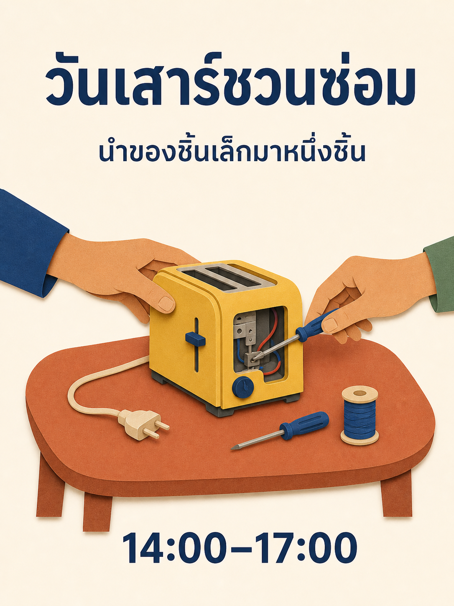

# คลังพรอมป์ต์ Qwen Image 3.0

180 รายการ สิบแปดหมวด หมวดละสิบ ฉบับ 15 ภาษาแปลแนวคิดเดิม 180 แนวคิด ไม่ได้นับสำเนาภาษาเป็นแนวคิดใหม่

[English](./README.md) · [简体中文](./README_zh.md) · [繁體中文](./README_tw.md) · [日本語](./README_ja.md) · [한국어](./README_ko.md) · [Español](./README_es.md) · [Français](./README_fr.md) · [Deutsch](./README_de.md) · [Português](./README_pt.md) · [Italiano](./README_it.md) · [Русский](./README_ru.md) · [العربية](./README_ar.md) · [ไทย](./README_th.md) · [Bahasa Indonesia](./README_id.md) · [Tiếng Việt](./README_vi.md)

## เลือกผลงาน

| รหัส | หมวดหมู่ |
| --- | --- |
| MKT-01–10 | [แบรนด์ โปสเตอร์ และแคมเปญ](./th/01-brand-social-marketing.md) |
| COM-01–10 | [อีคอมเมิร์ซ ผลิตภัณฑ์ และอาหาร](./th/02-ecommerce-product-food.md) |
| EDU-01–10 | [อินโฟกราฟิก การศึกษา และธุรกิจ](./th/03-infographic-education-business.md) |
| ART-01–10 | [ตัวละคร ภาพบุคคล และสตอรีบอร์ด](./th/04-portrait-character-storytelling.md) |
| DIG-01–10 | [อินเทอร์เฟซ การแก้ไขแบบควบคุม และการปรับให้เข้ากับภาษา](./th/05-ui-game-editing-multilingual.md) |
| AVA-01–10 | [อวตาร ทีม และภาพบุคคลในชีวิตประจำวัน](./th/06-profile-avatar-people.md) |
| SOC-01–10 | [โพสต์โซเชียล ปก และเนื้อหาครีเอเตอร์](./th/07-social-media-content.md) |
| ARC-01–10 | [สถาปัตยกรรม ภายใน และแนวคิดอสังหาริมทรัพย์](./th/08-architecture-interior-realestate.md) |
| FAS-01–10 | [แฟชั่น ความงาม และแนวคิดสิ่งทอ](./th/09-fashion-beauty-lookbook.md) |
| TRV-01–10 | [การเดินทาง ภูมิทัศน์ เมือง และยานพาหนะ](./th/10-travel-landscape-city-vehicle.md) |
| NAT-01–10 | [สัตว์ สิ่งมีชีวิต และการศึกษาพฤกษศาสตร์](./th/11-animal-creature-botanical.md) |
| TYP-01–10 | [ตัวอักษร งานออกแบบบรรณาธิการ และลวดลาย](./th/12-typography-logo-editorial-background.md) |
| PRO-01–10 | [แอสเซ็ตเกม อุปกรณ์ และแนวคิดอุตสาหกรรม](./th/13-game-assets-industrial-concepts.md) |
| PHO-01–10 | [ภาพถ่ายและความสมจริงแบบภาพยนตร์](./th/14-photography-cinematic-realism.md) |
| ILL-01–10 | [ภาพประกอบและการทดลองวัสดุ](./th/15-illustration-material-experiments.md) |
| DOC-01–10 | [เอกสาร สิ่งพิมพ์ และการออกแบบข้อมูล](./th/16-documents-publishing-information.md) |
| CUL-01–10 | [ประวัติศาสตร์ วัฒนธรรม และการตีความตามหลักฐาน](./th/17-history-culture-heritage.md) |
| SCI-01–10 | [วิทยาศาสตร์ แผนภาพเทคนิค และคำอธิบาย](./th/18-science-technical-knowledge.md) |

## พรอมป์ต์เด่น: เวิร์กช็อปซ่อมของ

[เปิด MKT-09](./th/01-brand-social-marketing.md#mkt-09) สารบัญสิบสองภาษามีภาพท้องถิ่นที่สร้างใหม่จากพรอมป์ต์เดียวกัน ภาพใช้ ImageGen ในตัว ไม่ใช่ Qwen และไม่ใช่ผลวัดสมรรถนะโมเดล



```text
สร้างโปสเตอร์ 3:4 สำหรับเวิร์กช็อปซ่อมของชุมชนสมมติ วาดโต๊ะสีดินเผาหนึ่งตัวที่มีเครื่องปิ้งขนมปังสีเหลือง ไขควงเล็ก และหลอดด้ายสีน้ำเงิน มือผู้ใหญ่สองมือทำงานกับเครื่องจากคนละด้าน ใช้รูปทรงกระดาษตัดที่สะอาด พื้นครีม ตัวอักษรกรมท่า และช่องว่างกว้าง ด้านบนเขียน "วันเสาร์ชวนซ่อม" ถัดลงมา "นำของชิ้นเล็กมาหนึ่งชิ้น" และด้านล่าง "14:00–17:00" แสดงแต่ละบรรทัดครั้งเดียวเท่านั้น มือสมเหตุสมผลทางกายวิภาคและเครื่องต้องถอดปลั๊ก ตัวแปร: ข้อความภาษาท้องถิ่นที่อนุมัติและชุดสี
```

## ใช้ข้อความตรงตามที่ระบุ

แทนข้อมูลในวงเล็บก่อนสร้าง ใส่ข้อความสุดท้ายที่จะอยู่บนภาพให้ตรงและอย่าให้โมเดลแต่งข้อเท็จจริงที่ขาด สำหรับพรอมป์ต์ตั้งใจสองหรือสามภาษา ให้คงภาษาที่ระบุ การแก้ตามภาพอ้างอิงต้องให้ภาพที่อนุญาตตามลำดับ

ใช้พรอมป์ต์ครบ ตรวจผล และแก้ทีละข้อ สตอรีบอร์ดนิ่งไม่ใช่วิดีโอ ภาพอินเทอร์เฟซไม่ใช่แอปทำงานได้ แผนภาพที่สร้างไม่ใช่เอกสารเทคนิคที่ผ่านการรับรอง

[แม่แบบผลิตงาน](../templates/README.md) · [พรอมป์ต์ภาพและที่มา](../assets/README.md) · [README หลัก](../README_th.md)
