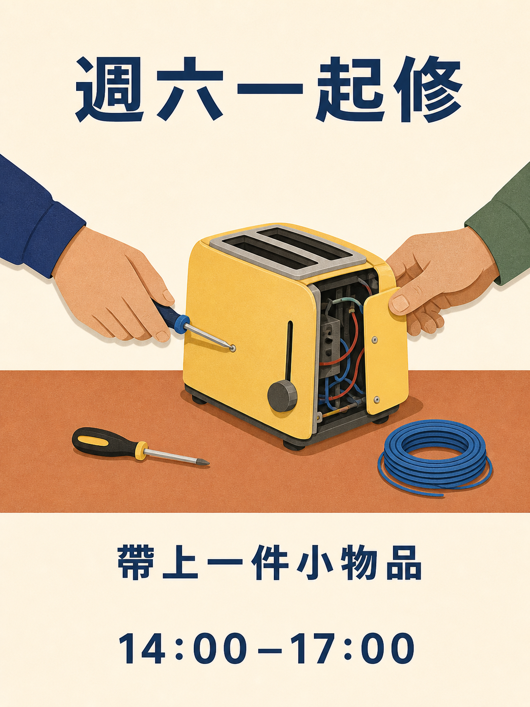

# Qwen Image 3.0 提示詞庫

180 條配方、十八個分類，每類十條。15 種語言版本翻譯的是同一組 180 個創意，語言副本不計為新增創意。

[English](./README.md) · [简体中文](./README_zh.md) · [繁體中文](./README_tw.md) · [日本語](./README_ja.md) · [한국어](./README_ko.md) · [Español](./README_es.md) · [Français](./README_fr.md) · [Deutsch](./README_de.md) · [Português](./README_pt.md) · [Italiano](./README_it.md) · [Русский](./README_ru.md) · [العربية](./README_ar.md) · [ไทย](./README_th.md) · [Bahasa Indonesia](./README_id.md) · [Tiếng Việt](./README_vi.md)

## 選擇目標產物

| ID | 分類 |
| --- | --- |
| MKT-01–10 | [品牌、海報與宣傳活動](./tw/01-brand-social-marketing.md) |
| COM-01–10 | [電商、產品與美食](./tw/02-ecommerce-product-food.md) |
| EDU-01–10 | [資訊圖表、教育與商業](./tw/03-infographic-education-business.md) |
| ART-01–10 | [角色、肖像與分鏡](./tw/04-portrait-character-storytelling.md) |
| DIG-01–10 | [介面、受控編輯與在地化](./tw/05-ui-game-editing-multilingual.md) |
| AVA-01–10 | [頭像、團隊與日常肖像](./tw/06-profile-avatar-people.md) |
| SOC-01–10 | [社群貼文、封面與創作者內容](./tw/07-social-media-content.md) |
| ARC-01–10 | [建築、室內與房產概念](./tw/08-architecture-interior-realestate.md) |
| FAS-01–10 | [時尚、美妝與紡織概念](./tw/09-fashion-beauty-lookbook.md) |
| TRV-01–10 | [旅行、景觀、城市與交通工具](./tw/10-travel-landscape-city-vehicle.md) |
| NAT-01–10 | [動物、幻想生物與植物研究](./tw/11-animal-creature-botanical.md) |
| TYP-01–10 | [字體、編輯設計與圖案](./tw/12-typography-logo-editorial-background.md) |
| PRO-01–10 | [遊戲素材、設備與工業概念](./tw/13-game-assets-industrial-concepts.md) |
| PHO-01–10 | [攝影與電影質感](./tw/14-photography-cinematic-realism.md) |
| ILL-01–10 | [插畫與材質實驗](./tw/15-illustration-material-experiments.md) |
| DOC-01–10 | [文件、出版與資訊設計](./tw/16-documents-publishing-information.md) |
| CUL-01–10 | [歷史、文化與基於證據的詮釋](./tw/17-history-culture-heritage.md) |
| SCI-01–10 | [科學、技術圖解與知識說明](./tw/18-science-technical-knowledge.md) |

## 精選配方：社區維修工坊

[開啟 MKT-09](./tw/01-brand-social-marketing.md#mkt-09)。十二種語言索引包含這條配方的新生成在地化插圖；這些圖使用內建 ImageGen 工具生成，不是 Qwen 輸出，也不是模型效能測試。



以下是這張圖實際使用的完整提示詞，詳見[素材來源與製作說明](../assets/README.md)。

```text
為虛構社區維修工坊製作一張 3:4 海報。畫一張陶土色桌子，上面放著黃色烤麵包機、小螺絲起子和一捲藍線；兩隻成年人的手從相對兩側修理烤麵包機。使用乾淨的剪紙形狀、奶油色背景、海軍藍文字和寬裕間距。頂部寫「週六一起修」；下方寫「帶上一件小物品」；底部寫「14:00–17:00」。每行僅出現一次，不添加其他文字。手部解剖結構須合理，烤麵包機須處於未插電狀態。可調變數：經核准的在地化文字和配色。
```

## 處理精確文案

生成前替換所有方括號輸入項。用引號明確給出最終畫面字串，不要讓模型編造缺失的事實。明確要求雙語或三語的配方須保留指定語言。參考圖編輯須按指定順序提供獲授權的圖片。

使用完整配方，檢查結果，每次針對一個問題調整。靜態分鏡不是影片，介面圖片不是可執行的應用程式，生成圖解不是經過驗證的技術文件。

[製作範本](../templates/README.md) · [素材提示詞與來源](../assets/README.md) · [繁體中文首頁](../README_tw.md)
