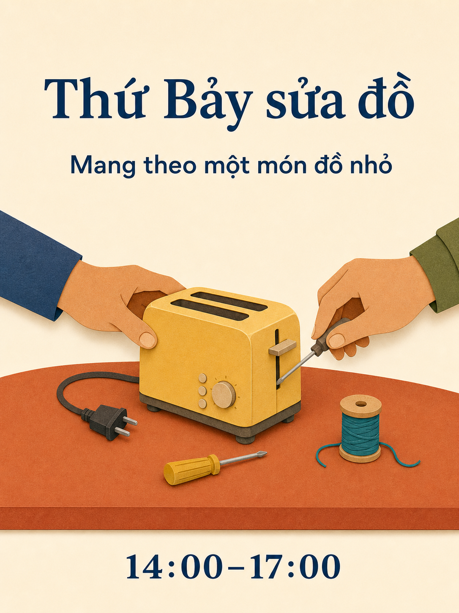

# Thư viện câu lệnh Qwen Image 3.0

180 mẫu, mười tám danh mục, mỗi danh mục mười mẫu. 15 bản ngôn ngữ dịch cùng 180 ý tưởng; bản sao ngôn ngữ không được tính thành ý tưởng mới.

[English](./README.md) · [简体中文](./README_zh.md) · [繁體中文](./README_tw.md) · [日本語](./README_ja.md) · [한국어](./README_ko.md) · [Español](./README_es.md) · [Français](./README_fr.md) · [Deutsch](./README_de.md) · [Português](./README_pt.md) · [Italiano](./README_it.md) · [Русский](./README_ru.md) · [العربية](./README_ar.md) · [ไทย](./README_th.md) · [Bahasa Indonesia](./README_id.md) · [Tiếng Việt](./README_vi.md)

## Chọn đầu ra

| Mã | Danh mục |
| --- | --- |
| MKT-01–10 | [Thương hiệu, áp phích và chiến dịch](./vi/01-brand-social-marketing.md) |
| COM-01–10 | [Thương mại điện tử, sản phẩm và ẩm thực](./vi/02-ecommerce-product-food.md) |
| EDU-01–10 | [Đồ họa thông tin, giáo dục và kinh doanh](./vi/03-infographic-education-business.md) |
| ART-01–10 | [Nhân vật, chân dung và bảng phân cảnh](./vi/04-portrait-character-storytelling.md) |
| DIG-01–10 | [Giao diện, chỉnh sửa có kiểm soát và bản địa hóa](./vi/05-ui-game-editing-multilingual.md) |
| AVA-01–10 | [Ảnh đại diện, đội nhóm và chân dung đời thường](./vi/06-profile-avatar-people.md) |
| SOC-01–10 | [Bài đăng mạng xã hội, ảnh bìa và nội dung sáng tạo](./vi/07-social-media-content.md) |
| ARC-01–10 | [Kiến trúc, nội thất và ý tưởng bất động sản](./vi/08-architecture-interior-realestate.md) |
| FAS-01–10 | [Thời trang, làm đẹp và ý tưởng dệt may](./vi/09-fashion-beauty-lookbook.md) |
| TRV-01–10 | [Du lịch, phong cảnh, thành phố và phương tiện](./vi/10-travel-landscape-city-vehicle.md) |
| NAT-01–10 | [Động vật, sinh vật và nghiên cứu thực vật](./vi/11-animal-creature-botanical.md) |
| TYP-01–10 | [Kiểu chữ, thiết kế biên tập và họa tiết](./vi/12-typography-logo-editorial-background.md) |
| PRO-01–10 | [Tài nguyên trò chơi, thiết bị và ý tưởng công nghiệp](./vi/13-game-assets-industrial-concepts.md) |
| PHO-01–10 | [Nhiếp ảnh và tính chân thực điện ảnh](./vi/14-photography-cinematic-realism.md) |
| ILL-01–10 | [Minh họa và thử nghiệm chất liệu](./vi/15-illustration-material-experiments.md) |
| DOC-01–10 | [Tài liệu, xuất bản và thiết kế thông tin](./vi/16-documents-publishing-information.md) |
| CUL-01–10 | [Lịch sử, văn hóa và diễn giải dựa trên bằng chứng](./vi/17-history-culture-heritage.md) |
| SCI-01–10 | [Khoa học, sơ đồ kỹ thuật và giải thích](./vi/18-science-technical-knowledge.md) |

## Câu lệnh nổi bật: buổi sửa đồ

[Mở MKT-09](./vi/01-brand-social-marketing.md#mkt-09). Mười hai mục lục ngôn ngữ có minh họa bản địa hóa mới của cùng mẫu. Chúng được tạo bằng ImageGen tích hợp, không phải Qwen, và không phải phép đo mô hình.



```text
Tạo áp phích 3:4 cho buổi sửa đồ cộng đồng hư cấu. Minh họa một bàn màu đất nung có máy nướng bánh vàng, tua vít nhỏ và cuộn chỉ xanh; hai bàn tay người lớn thao tác trên máy từ hai phía đối diện. Dùng hình cắt giấy rõ ràng, nền kem, chữ xanh hải quân và khoảng cách rộng. Trên cùng viết "Thứ Bảy sửa đồ"; dưới là "Mang theo một món đồ nhỏ"; cuối là "14:00–17:00". Mỗi dòng chỉ xuất hiện một lần, không thêm gì khác. Bàn tay phải hợp lý về giải phẫu và máy phải rút điện. Biến số: nội dung bản địa hóa đã duyệt và bảng màu.
```

## Làm việc với chữ chính xác

Thay đầu vào ngoặc vuông trước tạo. Trích đúng chuỗi cuối sẽ hiện trên ảnh, không nhờ mô hình bịa dữ kiện thiếu. Với mẫu cố ý song ngữ hoặc ba ngữ, giữ các ngôn ngữ đã chỉ định. Chỉnh theo tham chiếu thì cấp ảnh được phép đúng thứ tự.

Dùng mẫu đầy đủ, kiểm kết quả, mỗi lần chỉnh một lỗi. Bảng phân cảnh tĩnh không phải video; ảnh giao diện không phải ứng dụng hoạt động; sơ đồ tạo sinh không phải tài liệu kỹ thuật đã xác nhận.

[Mẫu sản xuất](../templates/README.md) · [Câu lệnh và nguồn gốc tư liệu](../assets/README.md) · [README chính](../README_vi.md)
